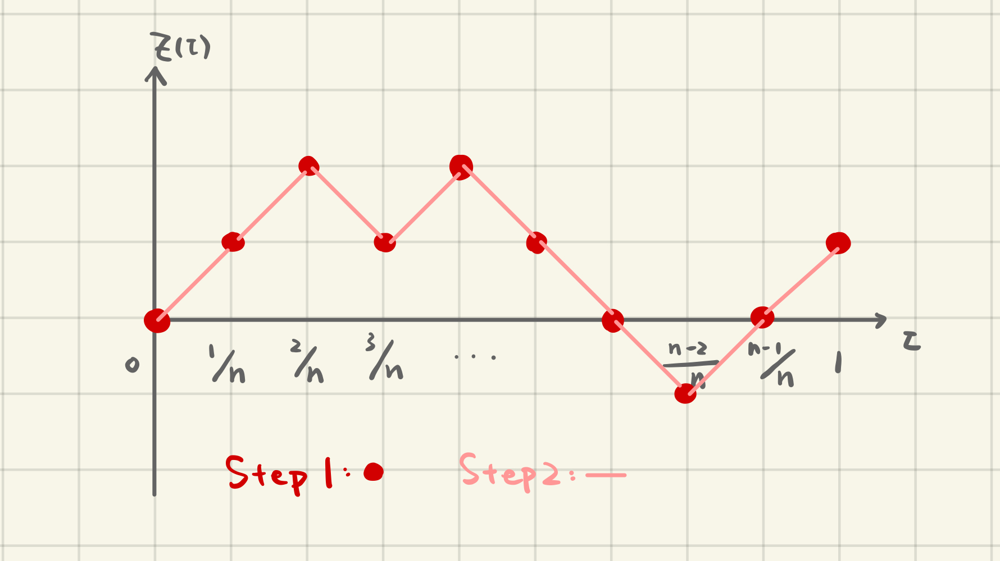

# Continuous Time Stochastic Process

Recall a discrete-time stochastic process can be treated as a series of random variables $\{X_t: t=0,1,...\}$. We describe the probability distribution of a discrete stochastic process by specifying distribution of each r.v., $X_t$. However, this can be difficult when $t$ takes value in an interval $[0,\infty)$:

> one of the main difficulties of studying continuous-time stochastic process is how to describe the probability distribution of it.

Setting aside this problem, we start by considering one of the most widely used continuous stochastic process in finance, the Brownian Motion.

## Bronwian Motion

### Definition

There exist s a probability distribution over the set of continuous function
$$
B: \mathbb{R}_+ \rightarrow \mathbb{R}
$$
such that:

1. $\Pr( B(0) = 0 ) = 1$;
2. (Stationarity) $\forall\ t,s \in [0,1]$,
$$
B(t) - B(s) \sim \mathcal{N}(0, t-s);
$$
3. (Independent increment) If intervals $\{[s_i, t_i]\}_i$ are non-overlapping, then increments $\{B(t_i) - B(s_i)\}_i$ are independent.

Remark: The probability distribution given by this theorem is called the **Brownian motion**, or **Wiener process**.

We can see that this theorem actually dodge the difficulty we mentioned; it doesn't describe the probability distribution of a Brownian motion, but merely says that the distribution exists.

### Intuitive Understanding

Vaguely speaking, a Brownian motion is the *'limit'* of simple random walks, the simplest [discrete-time stochastic process](./discrete-time.md).

How to construct this limit:

1. Let $Y_0, Y_1, ...Y_n$ be a simple random walk.  
Define
$$
Z(\frac{t}{n}) = Y_t, \qquad t=0,1,2,...,n,
$$
 i.e. scale the time axis;

2. For each fixed $i=0,1,...,n-1$,  
linearly extend all intermediate values $\tau \in [i/n, (i+1)/n]$,  
i.e. connect 2 points $\{i/n, (i+1)/n\}$ with straight lines;

3. Take $n\to\infty$, the resulting probability distribution $Z(\tau)$ is Brownian motion.

### Properties

A Brownian motion $B(t)$...

1. crosses the $t$-axis infinitely often;

2. does not deviate too much from $t=B^2$, since $Var[B_t] = t$;

3. Let $M(t) = \max_{s:s \leqslant t} \{B(s)\}$. Then for all $t>0$, $a>0$, $\Pr (M(t)>a) = 2\Pr (B(t)>a).$  
*Proof*: Let $\tau_a = \min\{t: B(t)>0\}$, i.e. the first time hitting $a$.  
By symmetry we have
    $\Pr(B(t)-B(\tau_a)>0 | \tau_a<t) = \Pr(B(t)-B(\tau_a)<0 | \tau_a<t)$
    and $\Pr(B(t)-B(\tau_a)>0 , \tau_a<t) = \Pr(B(t)-B(\tau_a)<0 , \tau_a<t).$
    Therefore,  

    \begin{align}
    \Pr(M(t)>a) &= \Pr(\tau_a < t) \\
    &= \Pr[B(t)-B(\tau_a)>0 , \tau_a< t ] + \Pr[B(t)-B(\tau_a)<0 , \tau_a<t]\\
    &= 2\Pr[B(t)-\underbrace{B(\tau_a)}_{a}>0 , \tau_a<t] = 2\Pr[B(t)>a].
    \end{align}

4. no-where differentiable, i.e. not differentiable for all $t \geqslant 0$ with probability 1.  
*Proof*: Suppose we have $$
\left. \frac{d B(t)}{dt} \right\lvert_{t-\tau} = A, $$  then $\exists\ \varepsilon,\ \forall\ \varepsilon' < \varepsilon$, we have
    $$
    | B(\tau+\varepsilon') - B(\tau) | \leqslant \varepsilon'.$$
    Therefore, $M(\varepsilon') \leqslant \varepsilon'A$.  
    However,

    \begin{align}
    \Pr (M(\varepsilon ') &>\varepsilon'A) = 2\Pr (B(\varepsilon')>\varepsilon 'A)\\
    &= 2\Pr (\mathcal{N}(0,\varepsilon ') > \varepsilon 'A) = 2\Pr (\mathcal{N}(0,1) > \sqrt{\varepsilon '}A).
    \end{align}  

    Let $\varepsilon\to 0$, then $\sqrt{\varepsilon}A \to 0$,
    $$
    \Pr(M(\varepsilon')>\varepsilon'A) = 2\Pr(\mathcal{N}(0,1) > 0) = 2 \cdot \frac{1}{2} = 1,
    $$
    which gives us a contradiction. Therefore $B(t)$ is no where differentiable.

## Quadratic Variation Theorem

Consider a partition of an arbitrary time interval $[0,T]$, given by
$$
0 = t_0 < t_1 < ... <t_n = T,
$$
and $X_t$ is a stochastic process. Consider the sum of squared changes
$$
Q_n(T) \doteq \sum_{i=1}^n \left[X_{t_i} - X_{t_{i-1}}\right]^2.
$$
As $n\to\infty$ and $\max\{t_i - t_{i-1} : i=1,2,..,n\} \to 0$, the limit of $Q_n(T)$ is called the **quadratic variation** of $X_t$.

For the specific case where
> $X_t$ is a standard Brownian motion, the quadratic variation of it is $T$ with probability 1, i.e. $$
\lim_{n \to \infty} \sum_{i=1}^n \left[B \left (\frac{i}{n} T \right) - B\left(\frac{i-1}{n} T\right)\right]^2 = T, \text{a.s}.
$$

*Sketch of Proof*: Let $t_i \doteq i/n \cdot T$.

\begin{align}
\sum_{i=1}^n\left[B(t_{i}) - B(t_{i-1})\right]^2 &= \sum_{i=1}^n Z_i^2 \qquad \text{where } Z_i \sim \mathcal{N}\left (0,\frac{T}{n}\right)\\
&\xrightarrow{SLLN} E[Z_i^2] \cdot n= T, \text{ as }n\to\infty.
\end{align}

Remark: If the time interval $[0,T]$ is infinitely small, i.e. $T=dt$, then in stochastic differential equations we have
$$
(d B_t)^2 = dt.
$$
