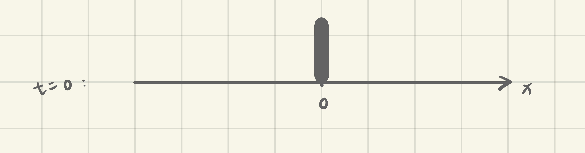
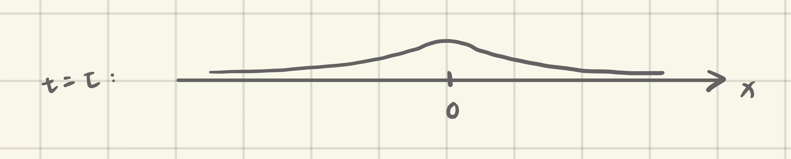

# Stochastic Differential Equation

## General Definitions

A differential equation of the form

$$
d X_t = \mu(t,X_t) d t + \sigma(t,X_t) d B_t \tag{*}
$$

where $X_t$ is a continuous-time stochastic process to be determined is called a **stochastic differential equation** (SDE).

To solve this equation, our goal is to find a stochastic process $X_t$ satisying
$$
X_t = \int \mu(s,X_s)ds + \int \sigma(s,X_s)dB_s.
$$

### Existence of a Solution

Equation $(*)$ has a solution. Furthermore, given the initial data $X(0) = x_0$, the solution is unique, as long as $\mu$ and $\sigma$ are 'reasonable', i.e. there exists a fixed constant $K$, such that

\begin{aligned}
| \mu(t,x) - \mu(t,y)|^2 + |\sigma(t,x) - \sigma(t,y)|^2 &\leqslant K|x-y|^2,\\
|\mu(t,x)|^2 + |\sigma(t,x)|^2 &\leqslant K(1 + |x|^2).
\end{aligned}

**Remarks**: The first inequality controls the derivatives, while the second controls values on the boundary.

## Analytically Solvable Examples

### Geometric Brownian Motion

Consider the following SDE:
$$
d X_t = \mu X_t dt + \sigma X_t dB_t
$$
where $X_0 = x_0, \mu \in (-\infty,+\infty), \sigma >0$.

**Solution**: Let $X_t = f(t,B_t)$ for a certain function $f(t,x)$. By Ito's Lemma,
$$
d X_t = \left(f_t + \frac{1}{2} f_{xx}\right) d t + f_x d B_t.
$$
Comparing this with the original equation gives us
$$
\mu f = f_t + \frac{1}{2}f_{xx}, \tag{1}
$$
$$
\sigma f = f_x. \tag{2}
$$
From $(2)$ we obtain $f = c_1(t) + c_2(t) \exp(\sigma x)$. Since
$$
f_x = \sigma c_2(t)\exp(\sigma x) = \sigma f,
$$
we know that $c_1(t) = 0$.
From $(1)$ we obtain
$$
\mu f = f_t + \frac{1}{2}\sigma^2 c_2(t) \exp(\sigma x).
$$
Therefore $f_t = (\mu - \sigma^2/2) f$, and $c_2(t) = c_3 \exp(\mu - \sigma^2/2)f$. So the solution of $f$ is in the form of
$$
f = c_3 \exp\left(\left(\mu - \frac{1}{2}\sigma^2 \right)t + \sigma B_t \right).
$$
Finally, with intial data we have $x_0 = X_0 = f(0,B_0) = f(0,0) = c_3$.

### Mean-reverting Process

We consider a specific Ornstein-Uhlenbeck process with mean $0$ and a geometric Brownian drift, i.e.
$$
d X_t = -\alpha X_t dt + \sigma dB_t
$$
where $X_0 = x_0, \alpha > 0$.

**Solution**: (The previous method will now fail...)  
Let
$$
X_t = a(t)\left(x_0 + \int_0^t b(s) dB_s\right)
$$
with $a(t),b(t)$ to be determind and $a(0) = 1$.
Then
$$
d X_t = a'(t) \cdot \frac{X_t}{a(t)} dt + a(t)b(t) dB_t.
$$
Comparing this with the original equation gives us
$$
-\alpha X_t = a'(t) \cdot \frac{X_t}{a(t)},
$$
and $a'(t) = -\alpha a(t)$, so $a(t) = c_1 \exp(-\alpha t)$. By $a(0) = 1$ we know $c_1 = 1$.  
Therefore, $b(t) = \sigma \exp(\alpha t)$. The final solution is

\begin{aligned}
X_t &= e^{-\alpha t} \left(x_0 + \int_0^t \sigma e^{\alpha s} dB_s\right)\\
&= \underbrace{x_0 e^{-\alpha t}}_\text{mean term} + \underbrace{\sigma \int_0^t e^{\alpha (s-t)} dB_s}_\text{variance term}.
\end{aligned}

## Numerical Methods

Stochasic differential equations that do not have analytic solutions must be solved by numerical methods.

### Finite Difference

This method can be applied to SDEs that can be reduced to PDEs. The main idea is to grid the time and space, and replace differential in the equation with differences.

Finite difference methods include explicit methods and implicit methods. The former is computationally cheaper, but the result may explode when the grid is too fine; the latter guarantees the unconditional stability but it is computationally expensive.

### Monte Carlo Simulation

Given any path of $B_t$, we can compute the corresponding path of $X_t$. Multiple (tens of thousands of) draws of paths of $B_t$ gives us the probability distribution of $X_t$.

### Tree Method

This method is based on the idea that Brownian motion is the limit of simple random walks, whose paths are essentially a binary tree.

We first compute the value of $X$ at each node including the leaves $\{X_T\}$ and corresponding probability distributions. Then compute the value of 'initial data', $V_T \doteq V(X_T)$, for each leaf. Finally we step backward and use the probability distribution to compute $V_t$ for $t < T$.

Different from Monte Carlo simulation, the tree method is particularly useful for pricing derivatives that are _path dependent_.

## Heat Equation

The heat equation is a partial differential equation but not an SDE. We introduce it here because the famous Black-Scholes equation can be reduced to a standard heat equation
$$
\frac{\partial u}{\partial t} = \frac{\partial^2 u}{\partial x^2}. \tag{3}
$$

### Linearity

If two functions $u_1, u_2$ satisfy $(3)$, then $u_1 + u_2$ also satisfy $(3)$.  
More generally, if $\{u_s : s\in I\}$ satisfy $(3)$, then $\int_I u_s ds$ also satisfies $(3)$.

Therefore, it suffices to solve $u(t,x)$ only for the boundary problem with initial data $u(0,x) = \delta_0(x)$. If this boundary problem has a solution $u_0(t,x)$, then the solution corresponding to initial data $v(x)$ is
$$
\int u_0(t,x-s) v(s) ds.
$$

### Analytic Solution

For boundary problem with initial data $u(0,x) = \delta_0(x)$, the solution is
$$
u(x,t) = \frac{1}{\sqrt{2 \pi t}}e^{-\frac{x^2}{4t}}. \tag{4}
$$
Therefore, solution to the boundary problem with initial data $v(x)$ is
$$
u(t,x) = \int^{+\infty}_{-\infty} \frac{1}{\sqrt{2 \pi t}}e^{-\frac{(x-s)^2}{4t}} v(s) ds.
$$

**Remark**: Notice that $(4)$ is the probability density function of a normal distribution. The physical interpretation of this solution is that:

1. Before time $t=0$, we hold a bunch of particles that are concentrated at the origin or $x$-axis;

2. At $t=0$ we release these particles, and they follow Brownian motions with no drift;
3. Overtime, say at time $t = \tau$, the locations of particles follow a normal distribution.

<!-- update 'nav' option in mkdocs.yml -->